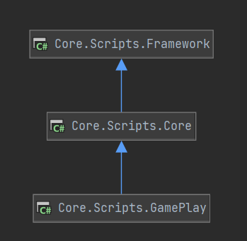

[TOC]

# UnityGameFramework-PureCSharp

## Script Architecture

The scripts is devided into three parts:
- Framework: The very basic codes that support the upper application. Such as:
    - AssetManager: An assetbundle system that manages loading assetbundles and unloading them
    - Log: Global log system, supporting multithread and writting to file in high performance
    - Net: A basic net system to communicate with servers
- Core: Sometimes we have some codes that use a lot in GamePlay level. So we can encapsulate them as a common pattern. Such as:
    - Event: Global event system
    - GameObjectPool
    - Timer
    - UISystem
- GamePlay: GamePlay is where the code changes the most. Different games need very different gameplay system. So there is no way to determine a common pattern that can handle every game. The followings are some gameplay modules can see in many games:
    - SceneManager: Manager how scene is loaded and unloaded
    - Bag system
    - Activity system
    - Equipment system
    - Character display system
    - Battle system

This division is also reflected in the reference relationship. The reference graph is like:

## The 3rd party

|Name|Link|Description|
|---|---|---|
|DOTween|[http://dotween.demigiant.com](http://dotween.demigiant.com)|DOTween is a fast, efficient, fully type-safe object-oriented animation engine for Unity, optimized for C# users, free and open-source, with tons of advanced features|
|TrueSync|[https://doc.photonengine.com/en-US/truesync/current/getting-started/truesync-intro](https://doc.photonengine.com/en-US/truesync/current/getting-started/truesync-intro)|Photon TrueSync is a multiplayer lockstep system for Unity built on top of Photon Unity Networking.|
|AVProVideo|[https://renderheads.com/products/avpro-video/](https://renderheads.com/products/avpro-video/)|AVPro Video is a plugin for Unity that gives developers an easy-to-use yet powerful video playback solution on multiple platforms.|
|GAutomator|[https://github.com/Tencent/GAutomator](https://github.com/Tencent/GAutomator)|GAutomator(Game Automator) is an open source test automation framework for mobile games.|
|LoopScrollRect|[https://github.com/qiankanglai/LoopScrollRect](https://github.com/qiankanglai/LoopScrollRect)|These scripts help make your ScrollRect Reusable.|

PS:
1. LoopScrollRect is different from the original version. 
    - Initialization method is different
    - Structure is different. In original version, there are three hierarchy levels: ScrollRect -> content -> cells. While four hierarchy levels here: ScrollRect -> View -> content -> cells. The reason for this change is there is a layout warning problem in original version and this problem may cause the layout not be rebuilt correctly in time. 
2. We use built-in VideoPlayer instead of AVProVideo in this framework for the latter is not free

## Miscellaneous

### Domain Reloading

For accelerating the startup in Editor mode, we disable the ***Reload Domain*** option in Project Settings. In exchange, we have to be concerned about more things, like initialization of static fields. See [Unity Domain Reloading](https://docs.unity3d.com/Manual/DomainReloading.html). We can use a Init Method with [RuntimeInitializeOnLoadMethod] attribute to finish this job while it doesn't work with generic class (typically, SingleTon). So we have to invoke the Init Method manually at the right beginning of game.

### Await Async

We have to introduce asynchronous framework to improve game performance and we have await/async keywords allowing us to write asynchronous codes easier. But I think it is not a good idea to write asynchronous codes too much, especially in GamePlay level. Like in AssetManager I provide two load APIs, one using the async/await keywords and the other using callback. In most cases, the design of GamePlay should be more synchronous and no need take too much care about the asynchronous process behind it. There are only a few cases where we need to wait for an asynchronous return and then execute the following logic.

One example is that `UIManager.OpenWindow()` is a synchronous function. But it opens window in asynchronous way. Developers only need to call `UIManager.OpenWindow()` and update window view in `UIWindow.OnOpen()`. UIManager will then deal with all the asynchronous problem, like it may not finally open for occurring exception.

## ToDo-List

- Integrate [huatuo](https://github.com/focus-creative-games/huatuo) for hot udpate
- Support assetbundle encryption
- Support protocol encryption
