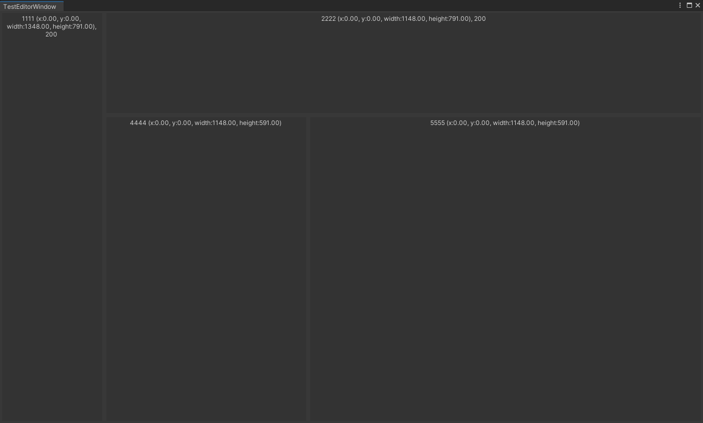

# SplitableWindow

Make Editor Window Split easy.

## Usage

The basic split code is like:
```c#
BeginHorizontalSplit(); // Or BeginVerticalSplit();
    // Do something;
Split();
    // Do something;
EndSplit();
```

Please mask sure that `Begin*Split();` and `EndSplit()` come in pairs.

Example
```c#
using QTC.Editor;
using UnityEngine;
using UnityEditor;

public class TestEditorWindow : SplitableWindow // Inherit SplitableWindow
{
    private static TestEditorWindow instance;

    [MenuItem("Examples/SplitableWindow")]
    private static void ShowWindow()
    {
        instance = GetWindow<TestEditorWindow>();
        instance.Show();
    }

    public void OnGUI()
    {
        InitSplitEnvironment(); // 1. Init Environment
        
        BeginHorizontalSplit();
        GUILayout.Box($"1111 {curSplitContext.rect}, {curSplitContext.firstSize}", GUILayout.ExpandWidth(true), GUILayout.ExpandHeight(true));
        Split();
        {
            BeginVerticalSplit();
            GUILayout.Box($"2222 {curSplitContext.rect}, {curSplitContext.firstSize}", GUILayout.ExpandWidth(true), GUILayout.ExpandHeight(true));
            Split();
            {
                BeginHorizontalSplit();
                GUILayout.Box($"3333 {curSplitContext.rect}", GUILayout.ExpandWidth(true), GUILayout.ExpandHeight(true));
                Split();
                GUILayout.Box($"4444 {curSplitContext.rect}", GUILayout.ExpandWidth(true), GUILayout.ExpandHeight(true));
                EndSplit();
            }
            EndSplit();
        }
        EndSplit();
    }
}
```

